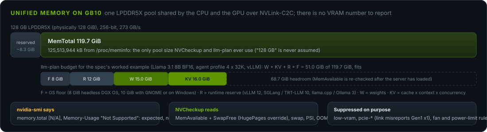

<div align="center">


<br>

[](https://github.com/thatcooperguy/NVCheckup/actions/workflows/ci.yml)
[](https://github.com/thatcooperguy/NVCheckup/actions/workflows/linux-fieldtest.yml)
[](https://github.com/thatcooperguy/NVCheckup/actions/workflows/linux-fieldtest-sim.yml)
[](https://github.com/thatcooperguy/NVCheckup/releases/latest)
[](LICENSE)
[](#supported-platforms)
[](https://go.dev)

**[Quick Start](#quick-start) · [What You Get](#what-you-get) · [Supported GPUs](#supported-gpus) · [Spark](#dgx-spark-rtx-spark-and-unified-memory) · [Commands](#command-reference) · [Privacy](#privacy-and-safety) · [FAQ](#faq) · [Landing page](https://thatcooperguy.github.io/NVCheckup/)**

*Unofficial community tool. Not affiliated with or endorsed by NVIDIA Corporation.*

---

</div>

## The Problem

It is 1:47 AM. Your screen went black mid-match, came back, and Event Viewer is now showing you something called `Event ID 4101` as if that explains anything. Or `nvidia-smi` sees your GPU perfectly well and PyTorch insists there is no such thing. Or you updated your kernel and the NVIDIA module has decided to take some time for itself.

So you open a forum thread. The first reply is "post your specs." The second is "did you try DDU." The third is from someone with the same problem in 2019, unresolved.

**NVCheckup writes the "post your specs" reply for you, then reads it, and tells you what to try next.**

It is a single, dependency-free binary that scans your NVIDIA GPU environment, matches what it finds against 45+ known failure patterns (plus 51 more that only wake up on a DGX Spark, RTX Spark or another unified-memory NVIDIA platform), and produces a clean report with ranked findings, plain-language explanations, and safe next steps. It is read-only by default, redacts your identity before writing anything, and runs on Windows and Linux, x86_64 and ARM64, including Windows on Arm. The optional `fix` command can apply a handful of well-understood settings changes, but only after you type `yes`, and every change is journaled so `undo` can put it back.

---

## What It Does

```
nvcheckup run --mode full --zip
```

In 20 to 60 seconds (add 30 to 60 more if you opt into `--network`), NVCheckup:

- **Scans** your GPU, driver, CUDA toolkit, PCIe link, thermal and throttle state, and system configuration
- **Detects** driver crashes (Event ID 4101, nvlddmkm), kernel module failures, version mismatches, thermal throttling
- **Identifies** overlay pile-ups, Secure Boot blocks, nouveau interference, DKMS build failures
- **Probes** PyTorch, TensorFlow, and CUDA framework configurations, and says exactly where the chain broke
- **Recognises** DGX Spark, RTX Spark and other unified-memory platforms, reads the shared memory pool from the OS instead of asking `nvidia-smi` for VRAM it does not have, and switches off the discrete-GPU rules that would otherwise cry wolf
- **Generates** a redacted, forum-ready report with the summary block at the top where the forum wants it
- **Packages** everything into a zip you can attach to a bug report without first grepping it for your own name

Every GPU the driver exposes gets diagnosed. Four GPUs means four sets of thermal and PCIe lines and a correspondingly longer report.

---

## Quick Start

### Option A: Download a release binary

Grab the binary for your platform from [GitHub Releases](https://github.com/thatcooperguy/NVCheckup/releases). Each file ships with a `.sha256` checksum. Check it; the binary is unsigned (see the FAQ).

```powershell
# Windows (the binary is unsigned; if SmartScreen appears, choose "More info" -> "Run anyway")
nvcheckup-windows-amd64.exe run --mode full --zip
# Windows on Arm (RTX Spark): use the native build, not the amd64 one under emulation
nvcheckup-windows-arm64.exe run --mode full --zip
```

```bash
# Linux
chmod +x nvcheckup-linux-amd64
./nvcheckup-linux-amd64 run --mode full --zip
```

### Option B: Install or build with Go

```bash
# Install straight into $GOPATH/bin
go install github.com/thatcooperguy/nvcheckup/cmd/nvcheckup@latest

# ...or build from a clone (see "Building from Source" below)
git clone https://github.com/thatcooperguy/NVCheckup.git
cd NVCheckup
go build -o nvcheckup ./cmd/nvcheckup
```

### What You Get

The top of `report.txt` is a summary block designed to be pasted into a support thread exactly as-is. It answers "post your specs" in nine lines, two of which pre-empt "is it thermal throttling" and "is your PCIe link fine":

<p align="center"></p>

<details>
<summary>The same block as plain text, with the report header</summary>

```
────────────────────────────────────────────────────────────────────────
  NVCheckup v0.2.2 — NVIDIA Diagnostic Report
  NVCheckup is an unofficial community tool, not affiliated with or endorsed by NVIDIA Corporation.
────────────────────────────────────────────────────────────────────────
  Generated: 2026-09-01 14:32:10 UTC
  Mode:      full
  Platform:  windows
  Runtime:   48.9s
  Redaction: ENABLED (PII removed)
────────────────────────────────────────────────────────────────────────

== SUMMARY (paste this in support threads) ==

NVCheckup v0.2.2 | 2026-09-01 14:32:10
OS: Microsoft Windows 11 Pro 10.0.26100 | Arch: amd64
GPU: NVIDIA GeForce RTX 4070 | Driver: 591.86 | VRAM: 12282 MB
CUDA (driver): 13.1 | CUDA Toolkit: 12.8
PyTorch: 2.5.1+cu118 (CUDA available)
Temp: 42°C | P-State: P8 | Util: 0%
PCIe: Gen1 x16 (idle, max Gen4)
Findings: 1 CRITICAL, 1 WARNING, 6 total | 2 auto-fixable
Top: Display Driver Resets Detected (Event ID 4101); nvlddmkm Driver ...
```

</details>

The rest of the report holds the system, GPU, platform and AI/CUDA sections, then every finding with its evidence, why it matters, next steps, and (when one exists) the `nvcheckup fix --id ...` command that addresses it. Complete examples: [`examples/sample-report-gaming.txt`](examples/sample-report-gaming.txt), [`examples/sample-report-ai-linux.txt`](examples/sample-report-ai-linux.txt) and, from the simulated GB10 scenario, [`examples/sample-report-dgx-spark.txt`](examples/sample-report-dgx-spark.txt).

---

## Who This Is For

### Gamers

Your display driver "stopped responding and has recovered." It did not feel recovered. NVCheckup reads the event log so you don't have to learn what nvlddmkm is, checks whether Discord, OBS, ShadowPlay and Game Bar are all drawing on the same frame (which is not a conflict, it is a default Windows install), flags HAGS and power plan settings, lists the Windows updates that landed in the last 60 days next to the crash count so you can blame the right vendor, and checks whether the GPU is throttling or stuck on a narrow PCIe link under load.

**Common issues detected:**
- Display driver stopped responding / recovered (nvlddmkm resets)
- Thermal throttling and GPUs running hot
- PCIe link running below its rated speed or width while busy
- Overlay software conflicts (Xbox Game Bar, Discord, RTSS, and friends)
- HAGS and power plan misconfigurations
- Windows Update regression correlation

### AI / CUDA Developers

`torch.cuda.is_available()` says `False`. `nvidia-smi` says everything is fine. They are both telling the truth, which is the annoying part. NVCheckup walks the whole chain, driver to toolkit to cuDNN to Python environment to framework build, and points at the exact link that is broken. Usually it is a CPU-only wheel. When it is Secure Boot instead, it will say so.

One thing worth knowing: the CUDA version in the top-right corner of `nvidia-smi` is what the driver supports, not what you installed. The report prints `CUDA (driver)` and `CUDA Toolkit` separately so that argument can end.

**Common issues detected:**
- CPU-only PyTorch wheel installed (no CUDA compiled in)
- CUDA toolkit or PyTorch build newer than what the driver supports
- NVIDIA kernel module not loaded (Linux)
- Secure Boot blocking unsigned modules
- DKMS build failure after a kernel update
- Kernel Xid errors, grouped by code, so "GPU has fallen off the bus" arrives as a finding rather than a screenshot (Linux)
- `LD_LIBRARY_PATH` / `PATH` missing CUDA libraries
- WSL2 `/dev/dxg` not present
- On DGX Spark: driver and GSP firmware pairing torn by a plain `apt upgrade`, CUDA 12 wheels on a CUDA 13 host, missing `sm_121` kernels, a ConnectX-7 twin that is up but has no address (see [the Spark section](#dgx-spark-rtx-spark-and-unified-memory))

### Streamers and Creators

Dropped frames during recording. Stutter that only shows up on stream. NVCheckup checks driver health, finds the overlay conflicts, and with `--network` can measure latency, jitter, and packet loss so you can stop blaming the encoder for what the Wi-Fi did.

### IT / Power Users

You want machine-readable output with stable identifiers. You want to diff system state before and after a driver update, so that "it was fine before the update" becomes a diff rather than a feeling. You want a support bundle that does not leak the hostname of a machine that is not supposed to exist. `--json` with stable finding ids, `snapshot` + `compare`, redaction on by default, and exit codes stable enough to use as a gate in a script.

---

## Supported GPUs

Anything the installed NVIDIA driver exposes through `nvidia-smi`. Nothing in NVCheckup is tied to a GPU model. The development machine happened to have an RTX 3090 in it; the parser fixtures deliberately do not stop there, and cover an RTX 5090 on a Gen5 link, an RTX 4060 Laptop wired at x8, a GTX 1060 on a pre-R535 driver, an A100 with no fan, an H100 in MIG mode, a Tesla T4, a Quadro RTX 8000 and a three-GPU rig.

| Class | Notes |
|-------|-------|
| GeForce GTX 900 series and newer, RTX 20/30/40/50 | Supported, including Gen5 PCIe on RTX 50. The PCIe rules compare against the maximum the GPU reports, so new generations need no special case |
| GeForce Laptop GPUs (Optimus / hybrid) | Many laptops wire the dGPU at x8. x8 of x8 is normal and is not flagged. When a powered-down dGPU makes `nvidia-smi` fail, the report quotes nvidia-smi's own message and the likely cause instead of a wall of parse errors |
| Workstation RTX / Quadro | Supported |
| Datacenter Tesla, A-series, H-series | Passive cards report no fan; we believe them. Under MIG, utilization is unavailable and idle/load inference falls back to P-state |
| Multi-GPU systems | Every GPU is collected and analyzed; the report gets per-GPU thermal and PCIe lines and `report.json` gets `gpu_thermal` and `gpu_pcie` arrays |
| Older drivers | If the driver rejects `clocks_event_reasons`, the legacy `clocks_throttle_reasons` field is used instead |
| Jetson / Tegra | Detected. Orin-class boards have no `nvidia-smi`, so GPU, thermal and PCIe checks are limited, and the report says so rather than reporting a missing driver. Jetson Thor (compute capability 11.0) ships `nvidia-smi`, so its absence is no longer how Jetson is recognised |
| DGX Spark / OEM GB10 (`NVIDIA GB10`) and RTX Spark (N1X) | Unified memory, GPU on the SoC package. No VRAM figure exists: `nvidia-smi` reports memory as `[N/A]` / `Not Supported`, the fan and power limit as `N/A`, and the PCIe link as `GEN 1@ 1x`, all by design. NVCheckup reads the pool from `/proc/meminfo` (Windows: `TotalVisibleMemorySize`), prints `PCIe: n/a (on-package, NVLink-C2C)` and suppresses the VRAM, fan, power-limit and PCIe rules. Implemented from public documentation and simulated in CI; unverified on hardware. Details in [the Spark section](#dgx-spark-rtx-spark-and-unified-memory) |

---

## DGX Spark, RTX Spark and unified memory

NVIDIA's GB10 (DGX Spark and the OEM GB10 boxes from ASUS, HP, Lenovo, Dell, MSI, Acer and Gigabyte) and N1X (the RTX Spark laptops and dev boxes) put the GPU on the same package as the CPU and hand both of them one pool of LPDDR5X. Every rule of thumb written for a card in a slot is wrong there. There is no VRAM number, no fan telemetry, no power limit and no user-serviceable PCIe link, and `nvidia-smi` says so in its own way: `[N/A]`, `Not Supported`, and a PCIe link reported as `GEN 1@ 1x`. Earlier versions of this tool would have produced four false alarms and one wrong `VRAM:` line on such a machine. This version recognises the platform first and reads the memory pool from the operating system.

<p align="center"></p>

**Status.** Implemented from NVIDIA's public documentation and community field reports (every fact below traces to a numbered source in [`docs/roadmap/spark-support.md`](docs/roadmap/spark-support.md)), exercised against a simulated GB10 in CI, and **not yet verified on hardware**. If you own a DGX Spark, an OEM GB10 or an RTX Spark device, [`scripts/spark-capture.sh`](scripts/spark-capture.sh) captures the read-only, redacted fixture set we are missing; attach it to [issue #3](https://github.com/thatcooperguy/NVCheckup/issues/3).

### What is detected

| Class | Recognised from | Effect |
|-------|-----------------|--------|
| `dgx-spark` | `/etc/dgx-release` (`DGX_NAME="DGX Spark"`), `lspci` `[10de:2e12]`, `nvidia-smi -L` name `NVIDIA GB10`; DMI `sys_vendor` says whether it is a Founders Edition (`NVIDIA`, `NVIDIA_DGX_Spark`, version `A.7`) or an OEM unit | Unified memory, on-package GPU, DGX OS / firmware / ConnectX-7 / ecosystem collectors run |
| `rtx-spark` | Windows on Arm plus PNP `PCI\VEN_10DE&DEV_2E03` or `DEV_2E06`, adapter name containing `RTX Spark N1X`, INF `nv_surface_woa.inf`; on Linux the same PCI ids (unsupported there, reported as such) | Unified memory, on-package GPU, Windows-on-Arm rules; a missing `nvidia-smi.exe` is INFO, not a missing driver |
| `jetson` | `/etc/nv_tegra_release` or a `NVIDIA Jetson` device-tree model (existing) | Unified memory |
| `grace-hopper` | `nvidia-smi` name `GH200` / `GB200` / `GB300` with a numeric memory total | Coherent memory but real HBM: the unified-memory suppressions are switched off on purpose |
| `arm64-dgpu` | aarch64 with an ordinary discrete GPU | Nothing special; the normal rules apply |

Detection runs in two steps. Phase 1 classifies from files, `lspci`, DMI and the kernel version, before any GPU query, so a GB10 whose driver failed to initialise is still a `dgx-spark` and gets the right diagnosis instead of "no NVIDIA GPU". After the GPU and PCIe collectors have run, the GPU-derived rows are evaluated and three flag rules are applied to every GPU: the class sets `unified_memory` and `on_package`; independently, any NVIDIA GPU whose `memory.total` is `[N/A]` is treated as unified memory even when no class matched; and Grace Hopper forces both flags off. A compute capability of 12.1 with `[N/A]` memory and no PCI-id match never asserts a class on its own.

What we know about GB10, from the spec's fact table (section 2.1):

| Fact | Value |
|------|-------|
| SoC | 20 Arm cores (10 Cortex-X925 + 10 Cortex-A725); Blackwell GPU with 48 SMs / 6,144 cores; compute capability 12.1 (`sm_121`); CPU and GPU joined by NVLink-C2C, no PCIe between them |
| Memory pool | 128 GB LPDDR5X, 256-bit, 273 GB/s, one coherent pool. Linux sees `MemTotal` 125,513,944 kB = 119.7 GiB on 2025 units (about 121.7 GiB on 2026 units); the rest is reserved for display and firmware |
| `nvidia-smi` | Name `NVIDIA GB10`, Bus-Id `0000000F:01:00.0`, Fan `N/A`, power cap `N/A`, Memory-Usage `Not Supported`, `--query-gpu=memory.total` prints `[N/A]`, max graphics clock 3003 MHz, PCIe `GEN 1@ 1x`. Temperature, P-state, power draw, SM clock and utilization work |
| Driver, CUDA | DGX OS 7 = Ubuntu 24.04 with Canonical's `linux-nvidia` kernel, `nvidia-driver-580-open`, CUDA 13.0. Founders Edition stack, Aug 2026: DGX OS 7.5.0, driver 580.159.03, CUDA 13.0.2, kernel 6.17, EC 3.5.8, USB PD 0.5.22, SoC 2.155.11 |
| Power | 240 W USB-C PD 3.1 EPR brick; SoC TDP 140 W, GPU about 120 W; `nvidia-smi -pl` unsupported; fan is EC-controlled with no telemetry |
| Networking | ConnectX-7 in multi-host mode: each QSFP cage is two PCIe Gen5 x4 "twins" (`enp1s0f0np0` + `enP2p1s0f0np0` for port 0), one cable = 200 Gb/s |

RTX Spark (N1X) is the Windows-on-Arm sibling: PCI `10DE:2E03` (6,144 cores) or `10DE:2E06` (5,120 cores), up to 128 GB of unified LPDDR5X, the 616.00 Developer Preview Arm64 driver and CUDA 13.4 Developer Preview as the first native Windows Arm64 toolkit. Its compute capability is inferred to be 12.1, not published. Run `nvcheckup-windows-arm64.exe` there; the amd64 binary under Prism emulation still works but is told off (`woa-nvcheckup-emulated`) because it sees an emulated CPU.

### What NVCheckup checks

Fifty-one rules were written for these platforms; the ones you are most likely to meet:

| Finding id | Severity | What it means |
|------------|----------|---------------|
| `dgx-spark-detected`, `rtx-spark-detected`, `grace-hopper-detected` | INFO | Platform recognised; the header names vendor, model, GPU, kernel and DGX OS / OTA version |
| `unified-memory-nvsmi-expected` | INFO | `nvidia-smi` memory `[N/A]` is normal here; the evidence quotes the real pool from `/proc/meminfo` |
| `unified-memory-pressure` | WARN, CRIT below 4 GiB | `MemAvailable` under 8 GiB with a GPU process, or memory PSI stalls: on unified memory, GPU exhaustion is system RAM exhaustion |
| `unified-memory-swap-in-use` | INFO, WARN with low `MemAvailable` | Swap in use under GPU load; the steps say to shrink the workload first and never to run `swapoff` while the model is loaded |
| `unified-memory-oom-events` | WARN, CRIT on NVRM | OOM-killer or `NV_ERR_NO_MEMORY` in the kernel log |
| `dgx-spark-gsp-init-failure` | CRIT | GB10 present in `lspci`, `nvidia-smi` says `No devices were found`, GSP / SEC2 timeouts in dmesg: driver and GSP firmware out of pairing, typically after a plain `apt upgrade` |
| `dgx-spark-ota-torn` | WARN | `nvidia-spark-ota-check` reports a torn OTA, or driver, firmware and kernel-module packages disagree |
| `dgx-spark-foreign-driver-packages` | WARN | `-server`, `fabricmanager`, `nvswitch` or non-`-open` driver packages on a Spark |
| `dgx-spark-ota-outdated`, `dgx-spark-firmware-behind` | WARN | Behind the current Founders Edition stack (OTA 7.5.0, driver 580.159.03, kernel 6.17; EC 3.5.8, SoC 2.155.11, USB PD 0.5.22). OEM units are only checked for pending capsules |
| `gb10-pd-power-wedge` | CRIT (WARN on one sample) | Community-reported USB-C power-delivery wedge: 90%+ utilization with the SM clock under 1400 MHz and under 40 W in every thermal sample. The first step is a cold power drain, not software |
| `gb10-logless-hard-poweroff` | WARN | Two or more boots whose journal ends without a clean-shutdown marker and an empty pstore |
| `arm64-cuda12-wheel-on-cuda13` | WARN, CRIT on import error | A `+cu12x` PyTorch wheel on a CUDA 13 host |
| `sm121-kernel-missing`, `sm121-triton-ptxas-stale` | WARN | `no kernel image is available`, `sm121` strings, a Triton `ptxas` too old for `sm_121a` |
| `arm64-container-amd64-image`, `docker-snap-gpu-blocked` | WARN | An amd64 image on an arm64 host; snap-confined Docker that cannot load NVML |
| `rtx-spark-driver-developer-preview`, `woa-cuda-toolkit-not-native`, `woa-nvcheckup-emulated` | WARN | Windows on Arm: pre-release driver, an x86_64 CUDA toolkit under Prism, NVCheckup itself emulated |

The full catalogue with triggers, evidence templates, sources and every next step is [`docs/roadmap/spark-rules.json`](docs/roadmap/spark-rules.json); the ids are mirrored in `knowledge/rules.json` and kept in lockstep with the analyzer by a test. On a unified-memory platform the old rules step aside: `low-vram` is never emitted, the PCIe rules skip on-package GPUs (so the misreported `GEN 1@ 1x` link cannot become `pcie-width-reduced`), a fan of `[N/A]` is not a stopped fan, `gpu-power-cap` prints `limit N/A (unified memory)`, and `no-nvidia-gpu` is not raised when `dgx-spark-gsp-init-failure` explains the absence.

### Reading `nvidia-smi` on unified memory

`[N/A]` for `memory.total`, `memory.used` and `memory.free` is the correct answer on GB10 and N1X, not a bug in your driver. NVML's `nvmlDeviceGetMemoryInfo` returns `NVML_ERROR_NOT_SUPPORTED`, which is also why Kubernetes device plugins before v0.17.4 advertise zero GPUs there. The truth about headroom is `/proc/meminfo`: NVCheckup uses `MemAvailable + SwapFree` (or `HugePages_Free x Hugepagesize` when huge pages are configured), never `MemFree`, never `cudaMemGetInfo`, and never "128 GB". The summary block therefore reads `Unified memory: 119.7 GiB total, 115.9 GiB available` instead of `VRAM:`, and a `UNIFIED MEMORY` section lists the pool, swap, swappiness, memory pressure and OOM counters.

### Impact and `Advisory:` steps

Some of the fixes users need on a Spark are not read-only: re-pairing a driver, flashing firmware, adding a netplan file, disabling suspend. NVCheckup will not do any of them, and no new `fix` action was added. Instead every finding carries an **impact** (`none`, `reversible`, `persistent`, `irreversible` or `data-loss`, the most invasive of its next steps), printed next to its severity, and any next step that would change driver, firmware, kernel, swap, systemd, firewall, Secure Boot, snap or netplan state starts with the word `Advisory:` and carries the exact revert command or an explicit data-loss warning. Advisory steps are printed with their own marker, always after the read-only steps, and they are advice you type yourself. The one place the word "reimage" appears, it is labelled a last resort that erases the unit.

### Two Sparks: the ConnectX-7 checks

Clustering two Sparks over the QSFP cage is where most of the field reports come from. The collector is read-only (`/sys/class/infiniband`, `/sys/class/net`, netplan keys, the `NCCL_*` environment of the NVCheckup process, avahi and ufw state; no pings, no bandwidth tests) and knows that the twins of one cage are the functions with the same index across PCI domains `0000` and `0002`, never "the same name minus a character". Healthy means both twins of the cabled cage `ACTIVE`, `200000` Mb/s, a distinct /24 each, MTU 9000 on every node, and `NCCL_IB_HCA` naming both twins the collector saw active. The rules: `cx7-not-enumerated` (CRIT; WARN for the known kernel regression), `cx7-twin-link-mismatch`, `cx7-link-speed-degraded`, `cx7-up-no-ip`, `cx7-twins-same-subnet`, `cx7-mtu-mismatch`, `nccl-env-misconfigured`, `nccl-gdr-assumed` (GPUDirect RDMA does not exist on Spark), `cx7-mdns-hostname-conflict` and `cx7-firewall-blocks-cluster`. An opt-in `cluster-test` that actually sends packets is deferred.

### `nvcheckup llm-plan`: will this model fit?

The question every Spark owner asks first, answered from measured memory instead of the number on the box.

```
nvcheckup llm-plan --model "Llama 3.1 8B Instruct" --quant bf16 --context 32768 --profile agent --concurrency 4 --runtime vllm
```

```
== VERDICT: FITS WITH WARNINGS (exit code 1) ==

  Component                                 GiB     How it was computed
  W   weights                                15.0   8.03e9 params x 2.00 B/param (bf16)
  KV  cache                                  16.0   131,072 B/token x 32768 tokens x 4 streams
  R   runtime reserve (vLLM)                 12.0   ~3 GiB runtime + torch.compile / CUDA graphs
  F   OS floor                                8.0   headless DGX OS
  Design total   W + KV + R + F               51.0   <= 119.7 GiB pool          fits (68.7 GiB headroom)
  Now            W + KV + R                   43.0   <= 115.9 GiB MemAvailable  fits

  vLLM --gpu-memory-utilization = ceil05(43.0 / 119.7) = 0.40

== ESTIMATES (ceilings, not measurements) ==
  Decode ceiling, one stream, weights-only:   17.0 tok/s
  Decode ceiling, one stream, at 32K context: 13.4 tok/s   (realistic band 6.7 - 10.7)
```

The full plan (prerequisite table, the `docker run` line, environment, warnings) is in [`examples/sample-llm-plan.txt`](examples/sample-llm-plan.txt). Without `--model` the wizard asks doctor-style questions; `--hf-config config.json` sizes a model from a local Hugging Face config offline; `--json` writes `plan.json`. Exit codes: 0 fits, 1 fits with warnings, 2 does not fit, 3 error. The three worked examples from the spec, on a 128 GB unit whose measured pool is 119.7 GiB:

| Model | Footprint (W + KV + R) | Verdict |
|-------|------------------------|---------|
| Llama 3.1 8B BF16, agent 4 x 32K, vLLM | 15.0 + 16.0 + 12 = 43.0 GiB | Fits, `u = 0.40`; ceilings 17 / 13.4 tok/s |
| Llama 3.3 70B NVFP4, 128K, vLLM | 36.8 + 40.0 + 12 = 88.8 GiB | Fits, `u = 0.75` (fp8 KV: 68.8 GiB, `u = 0.60`); BF16 at 131.5 GiB does not fit; ceilings 6.9 / 3.3 tok/s |
| gpt-oss-120b MXFP4, agent 4 x 32K, vLLM | 56.8 + 9.0 + 12 = 77.8 GiB | Fits, `u = 0.65`; measured 42-61 tok/s quoted, no formula ceiling |

`llm-plan` never downloads a model or image, never starts, stops or kills anything, never edits systemd units, sysctl, swap, fstab, env files or GNOME settings, never locks clocks, never reads `nvidia-smi` memory on unified platforms and never presents an estimate as a measurement. The runtime templates it prints (vLLM, TensorRT-LLM, SGLang, llama.cpp, Ollama) come from NVIDIA's DGX Spark playbooks; `--kv-cache-dtype fp8` is emitted for vLLM only if you ask for it with `--kv-dtype fp8`.

### The simulated GB10 in CI

CI cannot buy a Spark either. The "Linux field test (simulated GPU)" workflow gets a `gb10` job on an Arm64 Ubuntu runner: shims answer `nvidia-smi` (with `compute_cap`, `[N/A]` memory, `Not Supported` in the table), `lspci`, `dpkg`, `lsmod`, `dmesg`, `dmidecode`, `lscpu`, `ibdev2netdev`, `fwupdmgr` and `nvidia-spark-ota-check` from `.github/fieldtest/scenarios/gb10.json`, and `/etc/dgx-release`, `/etc/fastos-release`, DMI, meminfo, cpuinfo and thermal fixtures are injected under `NVC_SIM_ROOT`. The job asserts the expected findings, the absence of every discrete-GPU false alarm, `Platform: DGX Spark` and `Unified memory` in the summary, `platform.class == "dgx-spark"`, `pcie.on_package == true`, `gpus[0].memory_reporting == "not-supported"`, `unified_memory.mem_total_kb == 125513944` and an `impact` on every finding. A `gb10-gsp-fail` variant (`No devices were found` plus the SEC2 / GSP dmesg lines) must produce `dgx-spark-gsp-init-failure` and not `no-nvidia-gpu`. [`examples/sample-report-dgx-spark.txt`](examples/sample-report-dgx-spark.txt) is that scenario rendered by the shipped text renderer, with two deliberate WARN deviations added so an Advisory step is visible; the footer of the file lists which values are sourced and which are placeholders.

### What is not verified

Everything in this section is implemented from documentation and community reports and exercised against the simulation above; none of it has run on a GB10 or N1X yet. In particular the verbatim `nvidia-smi` output for every queried field, the `fwupdmgr` device names, whether a stock DGX OS install carries `nvidia-dkms-580-open`, the default swap configuration, the exact ConnectX-7 state strings and everything about `nvidia-smi.exe` on RTX Spark are open questions (spec section 12). Values the spec marks unconfirmed live behind named constants in the code with a comment saying so. The capture that closes them is one command: `scripts/spark-capture.sh`, read-only and redacted, attached to [issue #3](https://github.com/thatcooperguy/NVCheckup/issues/3).

---

## Diagnostic Modes

| Mode | Focus | Use When |
|------|-------|----------|
| `gaming` | Driver stability, overlays, event logs, power settings, thermal/PCIe | Black screens, crashes, stutter |
| `ai` | CUDA stack, PyTorch/TF probes, kernel modules | `torch.cuda.is_available() == False` |
| `streaming` | Driver health, overlay detection, capture checks | Recording/streaming issues, dropped frames |
| `creator` | Driver health, CUDA environment, creative readiness | Creative application issues |
| `full` | Everything | You are not sure what is wrong (start here) |

```bash
nvcheckup run --mode gaming --zip            # Gamer troubleshooting
nvcheckup run --mode ai --json --md          # AI/CUDA deep check
nvcheckup run --mode full --zip --json       # The works
nvcheckup run --mode gaming --network        # ...plus opt-in ping/traceroute/DNS probes
```

---

## Example Findings

### CRIT — Repeated Display Driver Resets Detected (Event ID 4101)

```
  [CRIT] #1: Display Driver Resets Detected (Event ID 4101) (driver-resets-4101)
    Evidence:     7 driver reset event(s) in the last 30 days. Most recent: 2026-08-30 22:15.
    Why:          Event ID 4101 indicates the display driver stopped responding and was recovered by Windows. Frequent occurrences cause black screens, freezes, and application crashes.
    Next Steps:
      • Update to the latest NVIDIA driver (clean install recommended).
      • Check GPU temperatures — overheating can trigger driver resets.
      • If overclocked, revert GPU clocks to stock settings.
      • Test with Hardware-Accelerated GPU Scheduling (HAGS) toggled off.
      • If recent Windows Update coincides with issues, consider testing a rollback (understand security implications first).
```

### WARN — PyTorch Installed Without CUDA Support

```
  [WARN] #2: PyTorch Installed Without CUDA Support (pytorch-cpu-only)
    Evidence:     PyTorch 2.8.0+cpu is installed but torch.version.cuda is empty — this is a CPU-only build.
    Why:          A CPU-only PyTorch wheel was installed. torch.cuda.is_available() returns False because the CUDA runtime is not compiled in.
    Next Steps:
      • Uninstall the current PyTorch: pip uninstall torch torchvision torchaudio
      • Reinstall with CUDA support from https://pytorch.org/get-started/locally/
      • Make sure to select a CUDA version no newer than your driver's (13.1).
```

### INFO — PCIe Link Power-Saving at Idle (expected)

Your GPU drops its PCIe link to Gen1 when it has nothing to do. This is not a defect. It is a nap. An earlier version of this tool used to wake it up and shout `DOWNSHIFTED`; the current version checks whether the GPU is asleep first.

```
  [INFO] #3: PCIe Link Power-Saving at Idle (expected) (pcie-idle-power-saving)
    Evidence:     Current: Gen1 x16. Maximum: Gen4 x16. P-state: P8. GPU utilization: 0%.
    Why:          Modern GPUs drop the PCIe link to Gen1 when idle to save power and raise it again under load. This reading was taken at idle, so it does not indicate a problem.
    Next Steps:
      • Re-run under GPU load to verify the link reaches Gen4.
```

### INFO with a fix attached — Power Plan Not Set to High Performance

```
  [INFO] #4: Power Plan Not Set to High Performance (power-plan-suboptimal)
    Evidence:     Active power plan: Balanced.
    Why:          Balanced or Power Saver plans may throttle CPU/GPU performance. For gaming or CUDA workloads, High Performance is generally recommended.
    Next Steps:
      • Open Power Options and switch to 'High Performance' for testing.
      • This is a reversible change with no risk.
    Fix:          nvcheckup fix --id set-high-performance
```

Every finding header ends with its stable id in parentheses, the same value as `findings[].id` in `report.json`, so a forum helper can say "ignore `pcie-idle-power-saving`, that one's fine" without quoting the whole block.

Corrected hardware errors (WHEA Event IDs 17, 19 and 47) get the same discipline: they are INFO, not WARN, and the evidence quotes the component and PCI address the event names, with the full event text in `report.json`. So when sixteen "hardware errors" turn out to be your network card politely correcting itself, you can prove it before anyone tells you to run memtest. For the record, the development machine is not clean either: its own report shows one real nvlddmkm event and sixteen of exactly those WHEA entries.

---

## Privacy and Safety

NVCheckup is built on a simple principle: **your data stays on your machine.** It is also built by people who have read too many READMEs that say that and then phone home, so here is the specific version.

| Guarantee | Detail |
|-----------|--------|
| No telemetry | Zero analytics, zero tracking, zero phone-home. There is no server to phone. |
| Network | None, unless you pass `--network` to `run`, answer yes to the network question in `doctor`, or use `network-test`. Then NVCheckup runs an ICMP ping and a traceroute to `1.1.1.1` and a DNS lookup of `google.com`, locally, and says so in the report footer. Nothing is uploaded anywhere. |
| Read-only | `run`, `snapshot`, `compare`, and `doctor` never modify anything. `self-test` never changes system settings; it creates and removes one temporary file in the current directory to verify write access. `fix` is opt-in: it asks for confirmation, journals every change, and can be reversed with `undo`. |
| No background services | No daemons, no scheduled tasks, no auto-updates, no tray icon, nothing in your startup apps. |
| PII redaction ON by default | For both `run` and `snapshot`. Usernames, hostnames, home paths, IPs, and email addresses are scrubbed before anything is written. |

### What Is Collected (Read-Only)

<details>
<summary>Full list</summary>

- OS version, kernel version, CPU model, RAM total, disk free space
- GPU model, driver version, VRAM, temperature, PCI bus ID, for every NVIDIA GPU
- GPU thermal and throttle state (clocks, power draw and limit, fan speed, active slowdown reasons), per GPU
- PCIe link state (current and maximum generation and width, power state, utilization), per GPU
- The `nvidia-smi` GPU table. The process list is stripped before it is stored; the stored table ends with the line `(Processes section omitted: process names are private)`, which is the binary saying it so we don't have to
- NVIDIA kernel module status and `/dev/nvidia*` nodes (Linux)
- Secure Boot state and DKMS build status (Linux)
- Jetson / Tegra release information when running on a Jetson (Linux)
- Platform identity on Arm and Spark systems: `/etc/dgx-release` and `/etc/fastos-release` (the serial number is redacted), DMI vendor / product / BIOS strings from `/sys/class/dmi/id`, `lscpu` model names, the kernel flavour, `lspci` vendor:device ids (Linux); `IsWow64Process2`, `Win32_Processor.Architecture`, `Win32_ComputerSystemProduct`, PNP device ids, the driver INF name and `dxdiag` dedicated / shared memory (Windows on Arm)
- On unified-memory platforms only: `/proc/meminfo`, `/proc/swaps`, `vm.swappiness`, `/proc/pressure/memory`, `/proc/vmstat` swap-in counters, OOM-killer and `NV_ERR_NO_MEMORY` counts (counts only, no process names), `nvidia-smi -q -d PERFORMANCE` event counters
- On DGX Spark only: `dpkg` versions of the NVIDIA driver, firmware and kernel-module packages, `nvidia-spark-ota-check summary`, `systemctl is-active` for the DGX Dashboard, fwupd, persistenced and clock-cap units, whether `127.0.0.1:11000` is in the listening state, read from `/proc/net/tcp` (no connection is opened), `fwupdmgr get-devices`, the first line of the container-toolkit apt source, `journalctl --list-boots` and the tail of the previous boot (classified as clean or not), whether `/sys/fs/pstore` is empty, ACPI thermal zones, the GDM sleep policy, suspend markers
- On DGX Spark only, ConnectX-7 state: `/sys/class/infiniband` port state and rate, netdev operstate, speed, MTU and IPv4 addresses (redacted as `<lan-ip>`), bonds, `/etc/nvidia/cx7-hotplug-enabled`, netplan address and MTU keys, the `NCCL_*` / `UCX_NET_DEVICES` variables of the NVCheckup process, avahi state and conflict count, `/etc/ufw/ufw.conf`, which RDMA tools exist. No packets are sent
- On Spark platforms in `ai`, `creator` and `full` modes: the PyTorch probe's stderr and `torch.cuda.get_arch_list()`, Triton's bundled `ptxas` version and `TRITON_PTXAS_PATH`, presence of `libcudart.so.12` / `.13`, `flash_attn` and `onnxruntime` versions and ORT providers, Docker image architectures and tags, `daemon.json` runtimes and CDI settings, `/etc/cdi/nvidia.yaml`, snap Docker, and which of the common inference ports (8000, 30000, 11434, 8355, 11000, 7474) are listening, without process names
- Event logs for driver crashes: Event ID 4101 and nvlddmkm (Windows, last 30 days)
- WHEA hardware error summaries, including the reporting device's PCI identifiers (Windows, last 30 days)
- Windows Update history (last 60 days)
- Installed overlay software (by name only; no process scanning)
- Python versions, PyTorch/TensorFlow/JAX versions and GPU visibility
- CUDA toolkit, cuDNN, and nvidia-container-toolkit versions
- With `--network` only: interface type, Wi-Fi band and signal, latency, jitter, packet loss, DNS time, traceroute hops

</details>

### What Is Never Collected

Passwords, tokens, API keys, browser data, SSH keys, clipboard contents, process lists or command lines, private documents, or anything outside the NVIDIA diagnostic scope. The serial number that the Spark collectors pass over (`DGX_SERIAL_NUMBER`) is redacted before it is written; the DMI serial files under `/sys/class/dmi/id` are not read.

### What NVCheckup Never Does on a Spark

It never changes clocks (`nvidia-smi -lgc` / `-rgc`), swap, sysctl, systemd units, netplan, firewall rules, Secure Boot, drivers or firmware, and `llm-plan` never downloads, starts, stops or kills anything. Where the right fix for a finding is one of those changes, the next step is printed as an `Advisory:` line with the exact revert command (or an explicit data-loss warning) and the finding carries an `impact` value so you can see, before reading further, whether the most invasive step is `none`, `reversible`, `persistent`, `irreversible` or `data-loss`. Advisory steps are advice you type yourself; they are not actions NVCheckup takes, and there is no `fix` action for any of them.

### Redaction

Redaction is on by default for `run` and `snapshot`:
- Your home directory becomes `<home>` (`C:\Users\yourname\AppData\...` becomes `<home>\AppData\...`)
- Other profile paths become `C:\Users\<user>\...`; your username as a bare word becomes `<user>` (standalone usernames shorter than 3 characters are not replaced, to avoid mangling ordinary words; paths containing them still are)
- Machine hostname becomes `<host>`
- Public IPs become `<public-ip-redacted>`
- LAN IPs become `<lan-ip>`
- Email addresses become `<email-redacted>`
- Wi-Fi network names become `SSID: <redacted>`
- The DGX Spark serial number (`DGX_SERIAL_NUMBER`) becomes `<serial>` (DMI serial files are not read); the `spark-xxxx` default hostname is a hostname and becomes `<host>`; ConnectX-7 fabric addresses are LAN IPs and become `<lan-ip>`

Version numbers that look like IP addresses (`NVIDIA App version 11.0.7.247`) are left intact, and so is the home directory of a user whose name merely starts with yours (`C:\Users\alice2` is not `<home>2`). Both of those were bugs once. GPU model names are not redacted; the whole point of the report is to say which card you have.

Use `--no-redact` only when you specifically need raw output and do not intend to share it. The forum does not need your hostname, and your hostname is probably your name.

---

## Command Reference

### `nvcheckup run`

Run diagnostics and generate a report. Read-only.

```
nvcheckup run [flags]
```

| Flag | Default | Description |
|------|---------|-------------|
| `--mode` | `full` | `gaming`, `ai`, `creator`, `streaming`, `full` |
| `--out` | `.` | Output directory |
| `--zip` | off | Bundle the generated report files into `nvcheckup-bundle-<timestamp>.zip` |
| `--json` | off | Generate structured `report.json` |
| `--md` | off | Generate GitHub/Reddit-ready `report.md` |
| `--network` | off | Opt in to network probes (ping and traceroute to 1.1.1.1, DNS lookup of google.com) |
| `--verbose` | off | Per-phase timings and collector notes as they happen |
| `--timeout` | `30` | Per-command timeout in seconds |
| `--redact` | **on** | Redact PII from all output |
| `--no-redact` | off | Disable PII redaction |
| `--include-logs` | off | Linux only: add `journalctl` and `dmesg` snippets to the report data. Ignored on Windows. Adds no extra files to the zip bundle |

### `nvcheckup fix`

List, preview, and apply a small set of well-understood settings changes. This is the **only** command that modifies your system.

```
nvcheckup fix                                  # list actions available on this platform
nvcheckup fix --all                            # preview every available action
nvcheckup fix --id <id> --dry-run              # preview one action, change nothing
nvcheckup fix --id <id>                        # apply after an interactive "yes"
nvcheckup fix --id <id> --journal DIR          # store the change journal somewhere else
```

Available actions:

| ID | Platform | Risk | Needs admin/root | What it does |
|----|----------|------|------------------|--------------|
| `set-high-performance` | Windows | low | yes | Switches the active power plan to High Performance |
| `disable-hags` | Windows | medium | yes | Disables Hardware-Accelerated GPU Scheduling (takes effect after a restart) |
| `disable-game-mode` | Windows | low | no | Turns off Windows Game Mode for the current user |
| `blacklist-nouveau` | Linux | medium | yes | Blacklists the nouveau driver and rebuilds the initramfs (takes effect after a reboot) |
| `update-ldconfig` | Linux | low | yes | Refreshes the shared library cache so `libcuda.so` can be found |

How it behaves:

- Elevation is checked **before** you are prompted, for both `fix` and `undo`. If an action needs admin/root and you are not elevated, NVCheckup tells you and exits without asking you to type `yes` into the void.
- You are shown a preview and must type `yes` to proceed. Anything else aborts.
- Every applied change is written to a journal at `<user config dir>/nvcheckup/nvcheckup-changes.json` (Windows: `%APPDATA%\nvcheckup\nvcheckup-changes.json`; Linux: `~/.config/nvcheckup/nvcheckup-changes.json`). On Linux, `sudo nvcheckup fix` journals under the invoking user's `~/.config/nvcheckup` when `SUDO_USER` is set, otherwise under `/root/.config/nvcheckup`. Use `--journal DIR` to override. `--out DIR` is accepted as a deprecated alias.
- `--dry-run` prints exactly what would be executed and changes nothing. It runs only the read-only capture commands the action uses to record the current state (for example `reg query`, `powercfg /getactivescheme`, `modinfo`, a package listing). Listing fixes, `--dry-run` and `undo` without `--id` do not even create the journal directory; it is created only when a change is applied or undone.
- `blacklist-nouveau` refuses to run unless an NVIDIA kernel module (proprietary or `nvidia-open`) is actually available for your running kernel, because blacklisting the only driver you have is not a fix, it is a black screen scheduled for the next boot.

### `nvcheckup undo`

Reverse a change made by `fix`.

```
nvcheckup undo                    # list journal entries
nvcheckup undo --id <id>          # undo the newest successful, not-yet-undone entry for that id
nvcheckup undo --id <id> --journal DIR
```

`undo` uses the previous value recorded in the journal. If the setting did not exist before the fix, undo removes it again rather than writing a made-up value; inventing a default and calling it a restore is how you end up on the forum yourself. Journal entries are validated before anything is written back to a privileged location, and a failed undo stays retryable.

### `nvcheckup network-test`

Standalone network diagnostics. This command always probes: 10 ICMP echoes to `1.1.1.1`, a traceroute/tracert to `1.1.1.1`, and an in-process DNS lookup of `google.com`. If ping produces no samples it says so rather than declaring your network healthy at 0.0 ms.

```
nvcheckup network-test [--timeout SEC]
```

### `nvcheckup snapshot`

Create a timestamped JSON snapshot for later comparison. Redacted by default.

```
nvcheckup snapshot [--out DIR] [--timeout SEC] [--no-redact]
```

### `nvcheckup compare`

Diff two snapshots. Useful for before/after driver updates. Flags come before the two positional files; extra positionals are an error. `--md` or an explicit `--out` writes `comparison.md` / `comparison.txt` into `--out` and prints the path.

```
nvcheckup compare [--out DIR] [--md] before.json after.json
```

### `nvcheckup doctor`

Interactive guided mode. Asks six questions (primary use case including Creator, the issue, any recent change, extended logs, whether to run the opt-in network probes, and output format), then runs targeted checks. None of the six is "did you try DDU." Read-only; network probes run only if you answer yes to that question. On a GB10 or N1X host it asks one more: "Plan an LLM deployment for this machine?" and hands off to `llm-plan`.

```
nvcheckup doctor
```

### `nvcheckup llm-plan`

Sizes an LLM deployment against the memory this machine actually has. Read-only; see [the Spark section](#nvcheckup-llm-plan-will-this-model-fit) for the arithmetic and a worked example.

```
nvcheckup llm-plan [--model NAME | --params B --active-params B --layers N --kv-heads N --head-dim N | --hf-config config.json] [flags]
```

| Flag | Default | Description |
|------|---------|-------------|
| `--model` | (asks) | A shape from `knowledge/models.json` (Llama 3.1 8B, Llama 3.3 70B, Qwen3-32B, Qwen3-235B-A22B, gpt-oss-120b, gpt-oss-20b, Nemotron-3-Super-120B-A12B). Without it the wizard asks doctor-style questions |
| `--params`, `--active-params`, `--layers`, `--kv-heads`, `--head-dim` | | Describe a model by hand (parameters in billions) |
| `--hf-config` | | Size a model from a local Hugging Face `config.json`, offline |
| `--quant` | | `bf16`, `fp8`, `q8_0`, `nvfp4`, `mxfp4`, `q4_k_m` |
| `--context` | | Context length in tokens |
| `--concurrency` | | Parallel streams; with `--profile agent` this is 1 + subagents |
| `--profile` | | `chat`, `agent`, `batch`, `rag` |
| `--runtime` | `auto` | `vllm`, `trtllm`, `sglang`, `llamacpp`, `ollama`, `auto` |
| `--kv-dtype` | `auto` | `auto`, `f16`, `fp8`, `q8_0`. vLLM `--kv-cache-dtype fp8` is only ever emitted when you pass `fp8` here |
| `--headroom-gib` | | Extra headroom to keep free |
| `--memory-gib` | measured | Override the pool for what-if planning; by default the measured `MemTotal` / `TotalVisibleMemorySize` is used and never a tier table |
| `--json` | off | Also write `plan.json` |
| `--out` | `.` | Output directory; the only place `llm-plan` writes |

Exit codes: `0` fits, `1` fits with warnings, `2` does not fit, `3` error.

### `nvcheckup self-test`

Verifies your environment has the tools NVCheckup needs, and that the exact `nvidia-smi` query fields the collectors rely on actually work on your driver. This check exists because v0.2.0 asked `nvidia-smi` for a field that does not exist and got the silent treatment for six months. It never changes system settings; it creates and removes one uniquely named temporary file in the current directory to verify write access.

```
nvcheckup self-test
```

### `nvcheckup version`

Prints the version and disclaimer. Also accepts `--version` and `-v`.

---

## Output Formats

| File | Format | When Generated |
|------|--------|----------------|
| `report.txt` | Human-readable, forum-pasteable | Always |
| `report.json` | Structured, machine-parseable (`metadata.schema_version`, `findings[].id` and `findings[].impact`, per-GPU `gpu_thermal` and `gpu_pcie` arrays, `platform`, and on Spark systems `unified_memory`, `dgx_os`, `cluster`, `ecosystem`) | `--json` |
| `report.md` | GitHub/Reddit markdown with tables | `--md` |
| `nvcheckup-bundle-<timestamp>.zip` | Zip containing the generated report files | `--zip` |

Every text and markdown report ends with a privacy footer stating that the report was generated locally, whether network probes were run at your request, and that `run` did not modify your system.

### Exit Codes

| Code | Meaning |
|------|---------|
| `0` | No significant issues detected |
| `1` | Warnings detected (non-critical) |
| `2` | Critical issues detected |
| `3` | Internal error (please open an issue) |

---

## Supported Platforms

| Platform | Architecture | Status |
|----------|-------------|--------|
| Windows 10 / 11 | x86_64 | Beta. Tested on Windows 11. |
| Linux (Ubuntu, Debian, Fedora, RHEL, Arch, and others) | x86_64 | Beta. Builds and unit-tests in CI; field reports wanted. |
| Linux | ARM64 (aarch64) | Beta. Builds and unit-tests in CI; field reports wanted. |
| Windows 11 on Arm (RTX Spark / N1X devices) | ARM64 | `nvcheckup-windows-arm64.exe` builds and unit-tests on a `windows-11-arm` runner (no GPU). Platform detection and the Windows-on-Arm rules are unverified on hardware |
| DGX Spark (Founders Edition and OEM GB10: ASUS, HP, Lenovo, Dell, MSI, Acer, Gigabyte), DGX OS 7 | ARM64 | Detected and specially handled (unified memory, DGX OS, ConnectX-7). Simulated in CI; unverified on hardware, capture wanted via `scripts/spark-capture.sh` and issue #3 |
| WSL2 | x86_64 (Arm where the device ships GPU passthrough, e.g. the Surface RTX Spark Dev Box) | Limited (GPU passthrough diagnostics) |
| Jetson / Tegra | ARM64 | Limited. Orin-class boards have no `nvidia-smi`; Jetson Thor (compute capability 11.0) ships it, so detection relies on `/etc/nv_tegra_release` and the device-tree model, not on its absence |

NVCheckup is designed for systems with NVIDIA GPUs. It will run on systems without NVIDIA hardware, but most diagnostics will report "not detected," and it will be right.

---

## Architecture

```
nvcheckup
├── cmd/nvcheckup/          CLI entry point
├── internal/
│   ├── core/               7-phase pipeline (see below)
│   ├── collector/
│   │   ├── common/         Cross-platform (system, GPU, nvidia-smi, thermal, PCIe, network, platform detection, unified memory)
│   │   ├── windows/        WMI, event logs, overlays, updates, WHEA, Windows on Arm
│   │   ├── linux/          Kernel modules, DKMS, Secure Boot, PRIME, Xid, DGX OS, ConnectX-7, AI ecosystem
│   │   ├── wsl/            WSL2 detection and /dev/dxg checks
│   │   └── ai/             CUDA, PyTorch, TensorFlow, Python envs
│   ├── analyzer/           Findings engine (rules → evidence → next steps), stable finding ids; Spark, cluster and Windows-on-Arm rules in analyzer_*.go
│   ├── remediate/          Opt-in fixes: catalog, preview, elevation check, journal, undo
│   ├── redact/             PII redaction engine
│   ├── report/             Output generators (txt, json, md)
│   ├── bundle/             Zip packaging
│   ├── snapshot/           Snapshot create/compare
│   ├── doctor/             Interactive guided mode
│   ├── llmplan/            llm-plan wizard: sizing, model shapes, runtime templates, prerequisites
│   └── selftest/           Environment verification
├── pkg/types/              Shared data structures
└── knowledge/              Reference knowledge pack (rules, Xid codes, remediations, LLM model shapes),
                            kept in lockstep with the analyzer by a test
```

<p align="center"></p>

The `run` pipeline has seven phases: collect system information, detect GPUs and drivers, collect thermal and PCIe data for every GPU, run platform-specific checks, check the AI/CUDA environment (mode-dependent), run network diagnostics (only with `--network`), and analyze results into findings.

Every collector is split into "run the command" and "parse the output," so the parsers are tested against captured `nvidia-smi`, `netsh`, PowerShell and `ping` output from machines the maintainers do not own. Every analyzer rule produces a finding with a stable kebab-case id, severity, evidence, and safe next steps. There are more than 45 general rules plus 51 for Spark and unified-memory platforms; the authoritative list is the set of non-test `.go` files in `internal/analyzer` (`analyzer.go`, `analyzer_spark.go`, `analyzer_cluster.go`, `analyzer_woa.go`), and a test refuses to pass if `knowledge/rules.json` drifts from it. Platform detection runs in two steps, before and after the GPU is queried, so a GB10 whose driver is dead is still diagnosed as a GB10. If a collector fails, NVCheckup records the error in the report's Collector Notes and continues. One missing command never takes down the whole run; a Windows event log with zero matching events, which older versions misread as a permissions failure, is now just a zero.

---

## Building from Source

```bash
git clone https://github.com/thatcooperguy/NVCheckup.git
cd NVCheckup

# Build for current platform
go build -o nvcheckup ./cmd/nvcheckup

# Build with a specific version string baked in
go build -ldflags="-s -w -X github.com/thatcooperguy/nvcheckup/pkg/types.Version=0.2.2" -o nvcheckup ./cmd/nvcheckup

# Cross-compile all targets
GOOS=windows GOARCH=amd64 go build -ldflags="-s -w" -o dist/nvcheckup-windows-amd64.exe ./cmd/nvcheckup
GOOS=linux   GOARCH=amd64 go build -ldflags="-s -w" -o dist/nvcheckup-linux-amd64       ./cmd/nvcheckup
GOOS=linux   GOARCH=arm64 go build -ldflags="-s -w" -o dist/nvcheckup-linux-arm64        ./cmd/nvcheckup
GOOS=windows GOARCH=arm64 go build -ldflags="-s -w" -o dist/nvcheckup-windows-arm64.exe ./cmd/nvcheckup

# Run tests (-race needs a C toolchain; on Windows run it under WSL or skip the flag)
go test ./...
```

NVCheckup is standard-library only. There is no `go.sum` because there are no dependencies. The stripped release binary is under 4 MB, which is smaller than the screenshot you were going to post instead.

---

## FAQ

**Is this official NVIDIA software?**
No. NVCheckup is an independent, community-maintained, open-source tool. It is not affiliated with, endorsed by, or supported by NVIDIA Corporation. It uses only public OS interfaces and publicly available command outputs. It also cannot get you a Founders Edition at MSRP.

**Does this replace DDU?**
No. NVCheckup diagnoses and does not remove drivers. If it recommends a clean reinstall, DDU (Display Driver Uninstaller) is one way to do the removing, and the report's next steps will say so.

**Will NVCheckup fix anything automatically?**
Not unless you ask it to. `nvcheckup run` is read-only and only suggests steps. `nvcheckup fix --id <id>` applies one specific change after you type `yes`; it is journaled and `nvcheckup undo --id <id>` reverses it.

**Is it safe to share the report publicly?**
Yes, with default settings. PII redaction is on by default: usernames, hostnames, home paths, IP addresses, and email addresses are replaced with placeholders, and the `nvidia-smi` process list is never stored, so nobody learns that you had Discord, three browsers and a game launcher open while training a model. Review the report before sharing if you have specific concerns.

**Does it work without admin/root?**
Mostly. Some checks (Windows event logs, Linux dmesg) benefit from elevated permissions. NVCheckup reports what it could not collect and why. `fix` actions that need elevation refuse to run until you are elevated.

**Why does `torch.cuda.is_available()` return False?**
The most common causes, in order:
1. CPU-only PyTorch wheel installed (check `torch.version.cuda`; if it is empty, this is it)
2. NVIDIA driver not installed or not loading
3. CUDA toolkit or PyTorch build newer than the driver supports
4. Wrong Python environment (conda/venv confusion)
5. On Linux: Secure Boot blocking the NVIDIA kernel module

Run `nvcheckup run --mode ai` for automated diagnosis. It has seen all five.

**How do I handle Secure Boot + NVIDIA on Linux?**
Two options:
1. **(Recommended)** Sign the NVIDIA module with a MOK key and enroll it. This preserves Secure Boot security while allowing the driver to load.
2. Disable Secure Boot in BIOS/UEFI. This works but reduces system security.

NVCheckup detects this situation and gives specific guidance.

**My report says my PCIe link is Gen1. Is my GPU broken?**
Almost certainly not. Idle GPUs drop to Gen1 to save power. The finding is tagged `(expected)` and INFO for exactly this reason. Run something heavy and re-run NVCheckup; if it still says Gen1 under load, now it is a WARN and worth chasing.

**My DGX Spark says `Memory-Usage: Not Supported` and `memory.total: [N/A]`. Is the driver broken?**
No. GB10 (and RTX Spark's N1X) share one LPDDR5X pool between CPU and GPU, and NVML has no separate VRAM figure to report, so `nvidia-smi` prints `[N/A]` / `Not Supported` by design. NVCheckup recognises the platform, tags the finding `unified-memory-nvsmi-expected` (INFO) and reports the real pool from `/proc/meminfo`: `Unified memory: 119.7 GiB total, N GiB available`. Headroom is `MemAvailable` (+ `SwapFree`), never `MemFree` or `cudaMemGetInfo`. Tools that insist on `nvmlDeviceGetMemoryInfo` (Kubernetes device plugins before v0.17.4, `accelerate device_map=auto`) will disagree; that is on them.

**Why is there no PCIe line for my DGX Spark, or why does it say `n/a (on-package, NVLink-C2C)`?**
Because the GPU is on the SoC package, connected to the CPU by NVLink-C2C. `nvidia-smi` still reports a PCIe link, and reports it as `GEN 1@ 1x`, which would look like a card stuck at the slowest possible speed if anyone believed it. The platform flags mark the GPU `on_package`, every PCIe rule is skipped for it, and the report prints `PCIe: n/a (on-package, NVLink-C2C)` instead of a downshift warning. `report.json` carries `pcie.on_package: true` so scripts can tell the difference too.

**Why is the Windows download flagged by SmartScreen?**
The release binaries are not code-signed. Verify the `.sha256` checksum, then choose "More info" -> "Run anyway". Or build from source; it takes a few seconds and needs nothing but Go.

---

## Contributing

Contributions are welcome. This project values clarity, safety, and cross-platform reliability. See [CONTRIBUTING.md](CONTRIBUTING.md) for the development setup, how to add collectors, analyzer rules, and remediation actions, and the pull request checklist.

- **Bug reports**: open an issue and attach your redacted NVCheckup report; the tool exists so that this is a reasonable thing to ask.
- **Feature requests**: open an issue describing the use case and which persona it serves.
- **Pull requests**: fork, branch, test, submit. Include unit tests for new collectors or analyzer rules.
- **Linux hardware**: have a Linux box or Jetson with an NVIDIA GPU? Run `scripts/linux-fieldtest.sh` (read-only, redacted) and attach the bundle to [issue #2](https://github.com/thatcooperguy/NVCheckup/issues/2). CI can only simulate a GPU on Linux; you have the real thing.
- **DGX Spark, OEM GB10 or RTX Spark hardware**: the whole Spark feature set is simulated so far. `scripts/spark-capture.sh` collects the read-only, redacted fixture set listed in spec section 12 (`/etc/dgx-release`, DMI strings, `lscpu`, `/proc/meminfo`, `lspci -nn`, `dpkg -l 'nvidia-*'`, every `nvidia-smi` query the collectors make, `nvidia-spark-ota-check summary`, `fwupdmgr get-devices`, `ibdev2netdev`, `ip -br addr`; on RTX Spark the `Win32_VideoController` fields). Attach it to [issue #3](https://github.com/thatcooperguy/NVCheckup/issues/3).
- **GPU fixtures**: "works on my machine" is a fixture-collection problem, and the fixture we are missing is yours. `nvidia-smi --query-gpu=... --format=csv,noheader,nounits` output from hardware we do not have is the single most useful contribution. Jetson `tegrastats`, RTX 50 laptops, vGPU: see CONTRIBUTING.md for where it goes.

See [CODE_OF_CONDUCT.md](CODE_OF_CONDUCT.md) for community guidelines and [CHANGELOG.md](CHANGELOG.md) for release history.

---

## License

[MIT License](LICENSE). Community maintained.

## Security

See [SECURITY.md](SECURITY.md) for vulnerability reporting guidelines.

---

<div align="center">

**NVCheckup exists to make diagnosing NVIDIA ecosystem issues faster, safer, and less frustrating.**

*Built by the community. For the community. Tested at 1:47 AM.*

</div>
